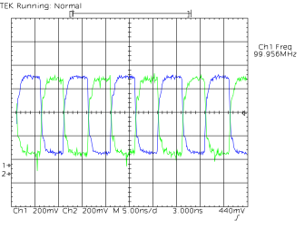

# TDS 820 and PC setup

To get automatic pdf and png conversion working, you need Ghostscript from
https://www.ghostscript.com/download/gsdnld.html.

Then connect your Tektronix TDS 820 to a PC with a null-modem and a (usb-) serial cable.

On the oscilloscope, open the hardcopy menu (shift-hardcopy on the front panel) to
- set Hardcopy Format to EPS Color, and
- set Hardcopy Port to RS-232

Format|Port
:-:|:-:
|

Next, open up the Utility menu (shift-display on the front panel)
- click on the System button until I/O is highlighted, then
- click on the Port button until RS-232 is highlighted.

System|Port
:-:|:-:
|

- in Hardware Setup, set to 19200-N-1 with hardware flagging off, and
- in Software Setup, set Soft Flagging off.

Hardware Setup|Software Setup
:-:|:-:
|

## Running on Windows

A usb-serial adapter on windows typically shows up as com3 (some would write \\.\COM3). The second argument is basename for created files. This will receive
intro2-1.eps and then convert it into intro2-1.pdf and intro2-1.png using ghostscript if available.

    C:\Users\you\src\tds820d>tds820d-win.exe com3 intro2 
    ready
    started receiving hardcopy
    received intro2-1.eps (30740 bytes)

## Running on Linux
    you@pc:~/src/tds820d$ ./tds820d /dev/ttyUSB0 intro2
    started receiving hardcopy
    received intro2-1.eps (30740 bytes)

# Raspberry Pi signals

1. Find the signal
2. adjust the knobs
3. hit hardcopy

54MHz oscillator|100MHz PCIe clock
:-:|:-:
|
