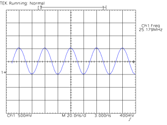

# tds820-read 

Connect your tektronix tds-820 to a Linux box with a null-modem
and (probably) a usb-serial cable. In the utility menu, set hardcopy port to RS-232 and speed to 19200bps. Set output format to EPS in
the hardcopy menu and run tds820-read on the computer.

Pressing hardcopy on the scope will result in the screen being
captured as eps,pdf and svg files on the computer.

## Example session

    aki@lapdell:~/src/tds820-read$ ./tds820-read /dev/ttyUSB0 tst
    started receiving hardcopy
    tst-1.eps exists
    tst-2.eps exists
    received tst-3.eps (17814 bytes)
    started receiving hardcopy
    tst-3.eps exists
    received tst-4.eps (34680 bytes)
    started receiving hardcopy
    tst-4.eps exists

# Raspberry Pi signals

1. Find the signal
2. adjust the knobs
3. hit hardcopy

## 25 MHz oscillator

## 54MHz oscillator

## PCIe 100 MHz differential pair with two probes

tst-6.eps exists
received tst-7.eps (18937 bytes)
started receiving hardcopy
tst-7.eps exists
received tst-8.eps (18491 bytes)
started receiving hardcopy
tst-8.eps exists
received tst-9.eps (19006 bytes)
started receiving hardcopy
tst-9.eps exists
received tst-10.eps (33393 bytes)
started receiving hardcopy
tst-10.eps exists
received tst-11.eps (35154 bytes)
started receiving hardcopy
tst-11.eps exists
received tst-12.eps (18711 bytes)
started receiving hardcopy
tst-12.eps exists
received tst-13.eps (25252 bytes)
started receiving hardcopy
tst-13.eps exists
received tst-14.eps (25342 bytes)
started receiving hardcopy
